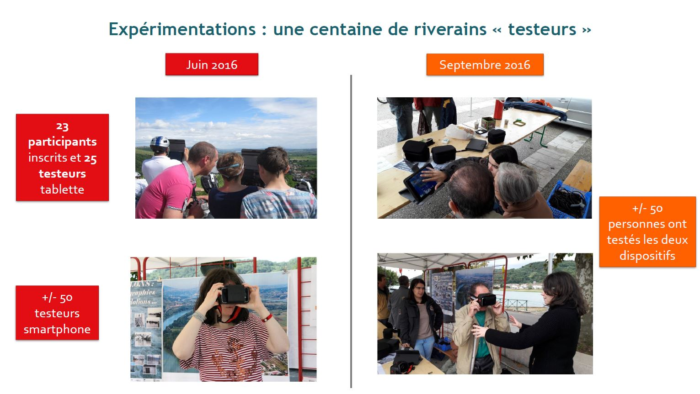

# Géovisualisations 3D, réalité virtuelle et réalité augmentée au service de la sensibilisation du public au risque d’inondation (2015-2016)

## Présentation du projet
Le projet FLOOD AR est un projet scientifique pluridisciplinaire qui vise à la sensibilisation au risque d’inondation des habitants en zones inondables à l’aide de visites 3D interactives visualisables sur des terminaux mobiles et connus du grand public que sont les tablettes et les smartphones. Il est brièvement présenté à l'adresse suivante (en anglais) : https://jacquinod.github.io/FLOODAR/.

## Consortium de recherche

Le projet a été conduit par la composante EVS-ISTHME de l'UMR CRNS 5600 “Environnement, Ville et Société” et géré par l'Université de Saint-Etienne. Pluridisciplinaire, il a rassemblé des chercheurs :

- en géographie et géomatique de l'UMR CNRS 5600,
- en sciences de l'information et de la communication de l'équipe Elico de l'EA 4147,
- en informatique du Laboratoire d'Informatique en Image et Systèmes d'information (LIRIS) de l'UMR CNRS 5205.

## Livrables du projet
Les méthodes et outils développés dans le cadre du projet sont mis à disposition afin que la démarche puisse être reproduite sur d'autres territoires.

### Support de présentation du projet
La présentation générale du projet et de son déroulement est téléchargeable [en format PDF](assets/PRESENTATION_PROJET_FLOODAR.pdf). Cette présentation contient également une synthèse du retour d'expérience des deux expérimentations menées avec les riverains du rhône à Sablons. L'analyse plus complète des expérimentations est disponible ci-après (voir [retour d'expérience](https://github.com/jacquinod/FLOODAR/blob/main/README.md#retour-dexp%C3%A9rience-sur-lutilisation-de-g%C3%A9ovisualisations-interactives-et-immersives-sur-site-%C3%A0-sablons))

Des films de présentation des dispositifs produits sont mis à disposition via Dailymotion ([Outil Tablette](http://www.dailymotion.com/video/x5evbbi_flood-ar-outil-tablette-protocole-et-utilisation-sur-site_school) et [Outil Smartphone](http://www.dailymotion.com/video/x5ev9jx_flood-ar-outil-smartphone-demo-et-utilisation-sur-site-sablons-2016_school)).

### Méthodologie 
La méhtode employée est décrite dans les fichiers suivants : 

- [méthodologie générale](assets/01_methodologie_generale.pdf)
- [annexe 1](assets/02_annexe1.pdf) - géoréférencer des objets modélisés en 3D pour un export en OBJ avec SketchUp
- [annexe 2](assets/03_annexe2.pdf) - génération des vues avec Spaceyes 3D
- [annexe 3](assets/04_annexe3.pdf) - créer une visite virtuelle avec la logiciel Panotour

### Retour d'expérience sur l'utilisation de géovisualisations interactives et immersives sur site à Sablons
Le projet FLOOD AR a donné lieu à 2 expérimentation en 2016 sur le territoire de Sablons. 
Le [retour d'expérience sur le potentiel de ces outils et leurs limites](assets/Evaluation_dispositif_ELICO_V0317.pdf) a été réalisée par les chercheurs en sciences de l'information et de la communication de l'équipe Elico.

## Financeurs
Le projet “Géovisualisations 3D, réalité virtuelle et réalité augmentée au service de la sensibilisation du public au risque d’inondation” a été financé dans le cadre du volet “Inondation” du [Plan Rhône-Saône 2014-2020](https://www.plan-rhone.fr/) par des fonds [FEDER de l'Union Européenne](https://www.europe-en-france.gouv.fr/fr/fonds-europeens/fonds-europeen-de-developpement-regional-FEDER), des fonds de la [Compagnie nationale du rhône (CNR)](https://www.cnr.tm.fr/) et des fonds de l'[Etat Français](https://www.plan-rhone.fr/le-plan-rhone/les-partenaires-signataires-du-plan-rhone-329.html). Il a également soutenu par le Programme d'avenir Lyon-Saint-Etienne (PALSE) dans le cadre de l'initiative “Image et perceptions embarquées” (PALSE-IPEm). Géovisualisations 3D a été cofinancé par l’Union Européenne dans le cadre du [Programme Opérationnel Interrégional FEDER Rhône-Saône 2014-2020](https://www.europe-en-auvergnerhonealpes.eu/programmes/le-programme-operationnel-interregional-feder-rhone-saone).

